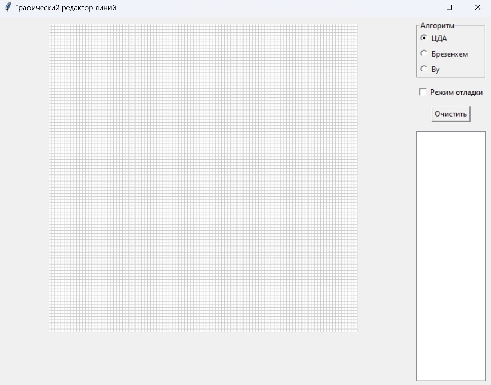
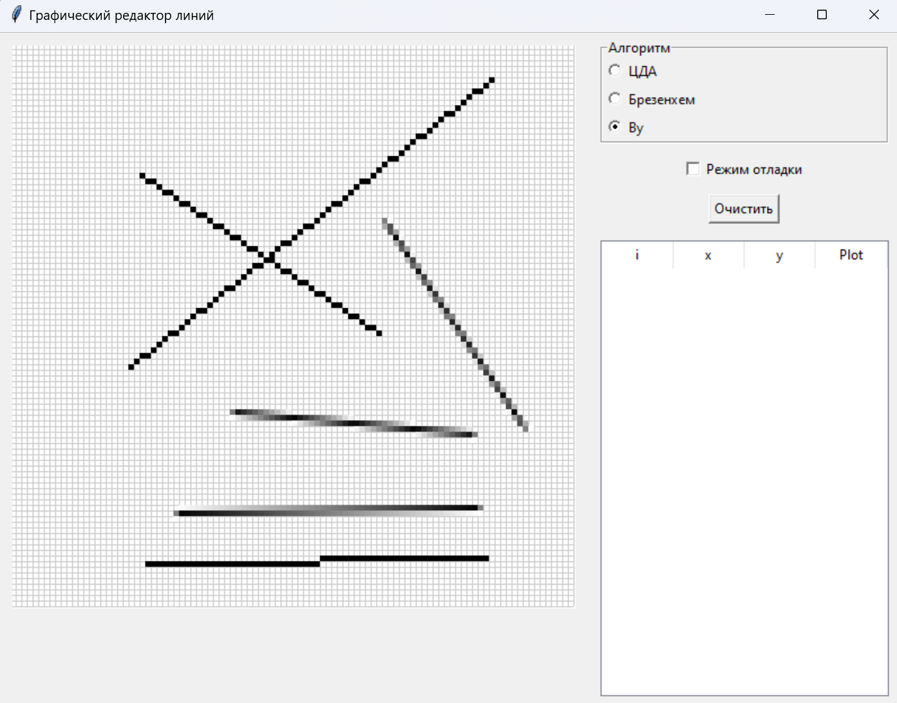

# Лабораторная работа №1 - Алгоритмы построения отрезков

## Задача
Разработать элементарный редактор, реализующий построение отрезков с помощью алгоритма ЦДА, целочисленного алгоритма Брезенхема и алгоритма Ву. Вызов способа генерации отрезка задается из пункта меню и доступно через панель инструментов "Отрезки". В редакторе кроме режима генерации отрезков в пользовательском окне должен быть предусмотрен отладочный режим, где изображается пошаговое решение на дискретной сетке


## Ход работы

### Средства разработки
1. Язык программирования Python.
2. Встроенная библиотека Tkinter.

### Описание алгоритма
1. При запуске приложения открывается окно с расчерченной сеткой. Справа находятся пункты выбора режима рисования линии, чекбокс запуска отладки, а также таблица, которая заполняется с включенным режимом отладки. Для каждого режима своя таблица.
2. Линия отрисовывается следующим путем: пользователь нажимает на экран - это первая координата линии, затем наводит курсор на место, где линия должна закончится, после нажимает еще раз - это вторая координата линии.
3. Если включен режим отладки, то линия рисуется попиксельно.
4. Для рисования линий используется 3 алгоритма:
    1. Алгоритм ЦДА:
        1. На вход подаются координаты начала и конца, вычисляются дельты.
        2. Вычисляется количество шагов - максимальное абсолютное значение из двух дельт.
        3. Вычисляются приращения по оси, затем рассчитываются сами координаты линии.
        4. Построение линии.
    2. Алгоритм Брезенхема:
        1. На вход подаются координаты начала и конца, вычисляются дельты.
        2. Определяются направления по осям.
        3. Инициализируется ошибка как разность дельты х и дельты у.
        4. Итеративно обновляются координаты начала, используя полученную ошибку.
        5. Построение линии, пока координаты начала не станут равными координатам конца.
    3. Алгоритм Ву:
        1. На вход подаются координаты начала и конца, вычисляются дельты.
        2. Проверяется наклон: если абсолютное значение dy больше dx, то координаты начала и конца, а также дельты меняются местами.
        3. Если  координата начала по оси Ox больше, чем координата конца по оси Ox, то координаты начала и конца меняются местами.
        4. Вычисляется градиент и интенсивность, затем координаты обновляются итеративно следующим образом: показатель интенсивность уменьшается на 1, затем если на текущем шаге он меньше 0, то координата y увеличивается на 1, показатель интенсивности ставится равным 1.
        5. Точки с координатами (x, y); (x, y + 1) отрисовываются каждый шаг. Это продолжается до тех пор, пока x не будет равен координате начала по оси Ox.

### Реализация основных частей кода

##### Алгоритм ЦДА

```
def dda(self, start, end):
    x1, y1 = start
    x2, y2 = end
    dx = x2 - x1
    dy = y2 - y1
    steps = max(abs(dx), abs(dy))

    if steps == 0:
        return []

    x_inc = dx / steps
    y_inc = dy / steps

    x = x1
    y = y1
    result = []

    for i in range(steps + 1):
        result.append({
            "i": i,
            "x": round(x),
            "y": round(y)
        })
        x += x_inc
        y += y_inc

    return result
```

##### Алгоритм Брезенхема

```
def bresenham(self, start, end):
    x1, y1 = start
    x2, y2 = end
    dx = abs(x2 - x1)
    dy = abs(y2 - y1)
    steep = dy > dx

    if steep:
        x1, y1 = y1, x1
        x2, y2 = y2, x2
        dx, dy = dy, dx

    if x1 > x2:
        x1, x2 = x2, x1
        y1, y2 = y2, y1

    dx = x2 - x1
    dy = abs(y2 - y1)
    error = dx / 2
    ystep = 1 if y1 < y2 else -1
    y = y1

    result = []
    i = 0

    for x in range(x1, x2 + 1):
        if steep:
            plot_x = y
            plot_y = x
        else:
            plot_x = x
            plot_y = y

        result.append({
            "i": i,
            "e": error,
            "x": plot_x,
            "y": plot_y,
            "e_new": error - dy
        })

        error -= dy
        if error < 0:
            y += ystep
            error += dx
        i += 1

    return result
```

##### Алгоритм Ву

```
def wu(self, start, end):
    x1, y1 = start
    x2, y2 = end
    result = []

    def ipart(x):
        return math.floor(x)

    def fpart(x):
        return x - math.floor(x)

    def rfpart(x):
        return 1 - fpart(x)

    dx = x2 - x1
    dy = y2 - y1
    steep = abs(dy) > abs(dx)

    if steep:
        x1, y1 = y1, x1
        x2, y2 = y2, x2
        dx, dy = dy, dx

    if x2 < x1:
        x1, x2 = x2, x1
        y1, y2 = y2, y1

    gradient = dy / dx if dx != 0 else 1.0

    xend = round(x1)
    yend = y1 + gradient * (xend - x1)
    xgap = rfpart(x1 + 0.5)
    xpxl1 = xend
    ypxl1 = ipart(yend)

    result.append({
        "i": 0,
        "x": xpxl1 if not steep else ypxl1,
        "y": ypxl1 if not steep else xpxl1,
        "intensity": rfpart(yend) * xgap
    })

    result.append({
        "i": 0,
        "x": xpxl1 if not steep else ypxl1 + 1,
        "y": ypxl1 + 1 if not steep else xpxl1,
        "intensity": fpart(yend) * xgap
    })

    intery = yend + gradient

    xend = round(x2)
    yend = y2 + gradient * (xend - x2)
    xgap = fpart(x2 + 0.5)
    xpxl2 = xend
    ypxl2 = ipart(yend)

    result.append({
        "i": x2 - x1,
        "x": xpxl2 if not steep else ypxl2,
        "y": ypxl2 if not steep else xpxl2,
        "intensity": rfpart(yend) * xgap
    })

    result.append({
        "i": x2 - x1,
        "x": xpxl2 if not steep else ypxl2 + 1,
        "y": ypxl2 + 1 if not steep else xpxl2,
        "intensity": fpart(yend) * xgap
    })

    index = 1
    for x in range(xpxl1 + 1, xpxl2):
        result.append({
            "i": index,
            "x": x if not steep else ipart(intery),
            "y": ipart(intery) if not steep else x,
            "intensity": rfpart(intery)
        })

        result.append({
            "i": index,
            "x": x if not steep else ipart(intery) + 1,
            "y": ipart(intery) + 1 if not steep else x,
            "intensity": fpart(intery)
        })

        intery += gradient
        index += 1

    return sorted(result, key=lambda s: s["i"])
```

### Результат работы программы

##### Главное окно программы


##### Отображение линий


