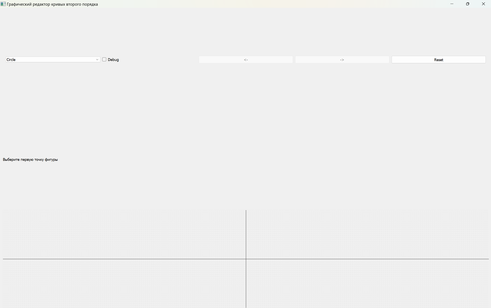
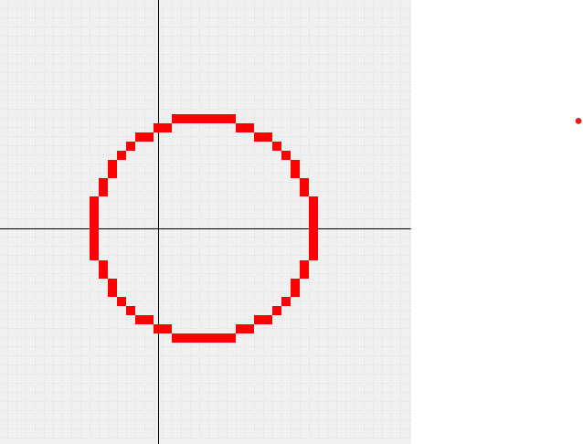
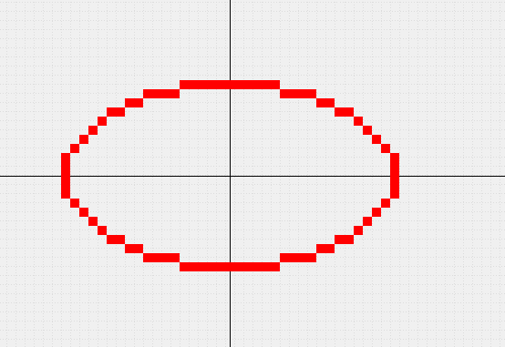
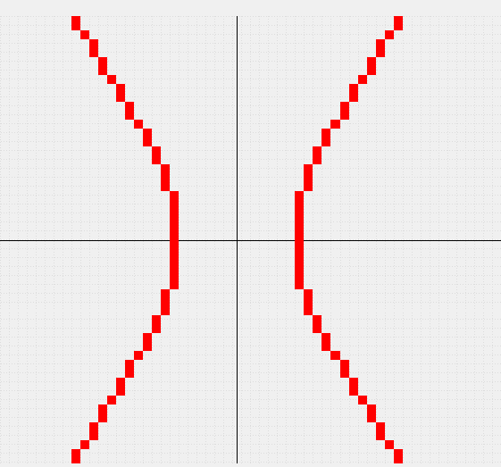
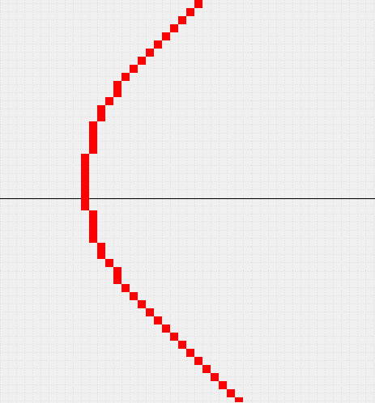

# Лабораторная работа №2 - Алгоритмы построения линий второго порядка

## Задача

---
Разработать элементарный графический редактор,
реализующий построение линий второго порядка: окружность,
эллипс, гипербола, парабола. Выбор кривой задается из 
пункта меню и доступен через панель инструментов
"Линии второго порядка". В редакторе, кроме режима генерации
линий второго порядка в пользовательском окне должен быть
предусмотрен отладочный режим, где отображается
пошаговое решение на дискретной сетке.

## Ход работы

---

### Средства разработки
1. Язык программирования Python.
2. Встроенная библиотека PyQt5.

### Описание алгоритма

1. Пользователь запускает приложение и может выбрать, какую линию второго порядка он хочет построить и хочет ли использовать отладочный режим.
2. Пользователь может нарисовать линию второго порядка с помощью кликов мыши.
3. Алгоритм построения окружности:
   1. Построение начинается из точки (0; R).
   2. Используется симметрия окружности - от одной точки получаем 8 симметричных по всем квадрантам.
   3. Вводится переменная ошибки (delta) для отслеживания отклонения от истинной окружности.
   4. На каждом шаге по x проверяем значение delta
      1. если ошибка мала, увеличиваем x
      2. если ошибка велика, уменьшаем y и корректируем delta
   5. Алгоритм завершается, когда y < x.
4. Алгоритм построения эллипса:
   1. Инициализируются значения a^2, b^2 - квадраты полуосей.
   2. Построение начинается с точки (0; b), используется переменная ошибки (delta).
   3. Первая зона (до пересечения касательных):
      1. двигаемся по x
      2. считаем отклонение delta, на его основе решаем, нужно ли также уменьшать y
   4. Вторая зона:
      1. двигаемся по y
      2. аналогично вычисляется delta и корректируются x и y
   5. Для каждой точки строятся 4 симметричных относительно центра эллипса.
5. Алгоритм построения гиперболы:
   1. Проходимся по значениям y в пределах допустимого диапазона.
   2. Вычисляем соответствующее значение x = sqrt(a^2 * (1 + y^2 / b^2)).
   3. x округляется до целого и строятся 4 симметричные точки - 2 ветви гиперболы.
   4. Если x выходит за допустимый диапазон, точка игнорируется, так как она не будет видна на экране.
6. Алгоритм построения параболы:
   1. Построение начинается из точки (0; 0).
   2. Вводится переменная delta для оценки ошибки.
   3. Пока значение x не превышает ограничение:
      1. если delta < 0, увеличиваем y, корректируем delta.
      2. иначе увеличиваем x и y, корректируем delta.
   4. Для каждой точки рисуем её зеркальное отражение относительно оси симметрии параболы.

### Реализация основных частей кода

**Построение окружности**
```python
def step_by_step(self) -> Generator[dict, None, None]:
    x0: int = self.parameters['center_x']
    y0: int = self.parameters['center_y']
    radius: int = self.parameters['radius']

    x: int = 0
    y: int = radius
    delta: int = 1 - 2 * radius

    while y >= x:
        # current state return
        step_data: dict[str, any] = {
            'points': [
                (x0 + x, y0 + y),
                (x0 - x, y0 + y),
                (x0 + x, y0 - y),
                (x0 - x, y0 - y),
                (x0 + y, y0 + x),
                (x0 - y, y0 + x),
                (x0 + y, y0 - x),
                (x0 - y, y0 - x)
            ],
            'delta': delta,
            'x': x,
            'y': y
        }
        yield step_data

        # next step calculation
        x += 1
        if delta < 0:
            error: int = 2 * delta + 2 * y - 1
            if error <= 0:
                delta += 2 * x + 1
            else:
                y -= 1
                delta += 2 * (x - y + 1)
        else:
            y -= 1
            delta += 2 * (x - y + 1)
```

**Построение эллипса**
```python
def step_by_step(self) -> Generator[dict, None, None]:
    x0 = self.parameters['center_x']
    y0 = self.parameters['center_y']
    a = self.parameters['a']
    b = self.parameters['b']

    a2 = a * a
    b2 = b * b
    x = 0
    y = b

    # Начальное значение ошибки
    delta = b2 - a2 * b + 0.25 + a2
    dx = 0
    dy = 2 * a2 * y

    # Первая зона
    while dx < dy:
        yield {
            'points': self._reflect_points(x0, y0, x, y),
            'x': x, 'y': y, 'delta': delta
        }

        if delta < 0:
            x += 1
            dx += 2 * b2
            delta += dx + b2
        else:
            x += 1
            y -= 1
            dx += 2 * b2
            dy -= 2 * a2
            delta += dx - dy + b2

    # Вторая зона
    delta = b2 * (x + 0.5) ** 2 + a2 * (y - 1) ** 2 - a2 * b2
    while y >= 0:
        yield {
            'points': self._reflect_points(x0, y0, x, y),
            'x': x, 'y': y, 'delta': delta
        }

        if delta > 0:
            y -= 1
            dy -= 2 * a2
            delta += a2 - dy
        else:
            x += 1
            y -= 1
            dx += 2 * b2
            dy -= 2 * a2
            delta += dx - dy + a2
```

**Построение гиперболы**
```python
def step_by_step(self) -> Generator[dict, None, None]:
    x0 = self.parameters['center_x']
    y0 = self.parameters['center_y']
    a = max(2, self.parameters['a'])
    b = max(2, self.parameters['b'])

    a2 = a * a
    b2 = b * b
    MAX_X = 200

    for y in range(0, 101):
        try:
            x_sq = a2 * (1 + (y * y) / b2)
            x = int(x_sq ** 0.5)
        except ZeroDivisionError:
            continue
        except ValueError:
            continue

        if x > MAX_X:
            continue

        points = [
            (x0 + x, y0 + y), (x0 + x, y0 - y),
            (x0 - x, y0 + y), (x0 - x, y0 - y)
        ]

        yield {
            'points': points,
            'x': x,
            'y': y,
            'delta': 0
        }
```

**Построение окружности**
```python
def step_by_step(self) -> Generator[dict, None, None]:
    x0 = self.parameters['center_x']
    y0 = self.parameters['center_y']
    p = self.parameters['p']

    x, y, delta = 0, 0, 1 - p

    while x < x0 + 100:
        yield {
            'points': self._reflect_points(x0, y0, x, y),
            'x': x, 'y': y, 'delta': delta
        }

        if delta < 0:
            y += 1
            delta += 2 * y + 1
        else:
            x += 1
            delta += -2 * p + 2 * y + 1
            y += 1
```

### Результат работы программы

**Главное окно программы**


**Нарисованная окружность**


**Нарисовнный эллипс**


**Нарисованная гипербола**


**Нарисованная парабола**
