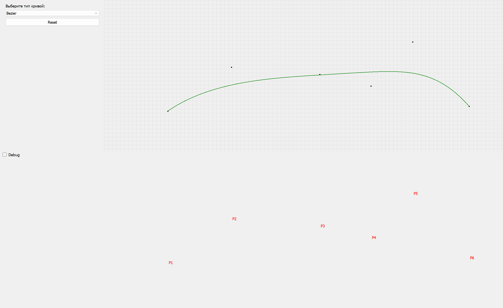

# Лабораторная работа №3 - Интерполяция и аппрокисмация кривых

## Задача

---

Разработать элементарный графический редактор, реализующий построение параметрических кривых,
используя форму Эрмита, форму Безье и В-сплайн. Выбор метода задается из пункта меню и доступен
через панель инструментов "Кривые". В редакторе должен быть предусмотрен режим корректировки
опорных точек и состыковки сегментов. В программной реализации необходимо реализовать
базовые функции матричных вычислений.

## Ход работы

---

### Средства разработки
1. Язык программирования Python.
2. Встроенная библиотека Numpy.
3. Встреонная библиотеке PyQt5.

### Описание алгоритма
1. Пользователь с помощью левой кнопки мыши может ставить на координатной плоскости точки.
2. При достаточном количестве точек начнет строится кривая, которая будет адаптироваться к каждой новой точке.
3. Снизу под координатной прямой отображается общее расположение точек(без координатной плоскости) и их названия(Р1, ..., Pn)
4. Если пользователь нажмет на точку, то он сможет ее перемещать, кривая также будет изменяться с перемещением точки.
5. Алгоритм построения кривой Эрмита:
   1. Задать последовательность контрольных точек.
   2. Для каждой пары точек Pi и Pi+1 определить касательные вектора:
      1. Для крайних точек касательные считаются как разность с ближайшей точкой.
      2. Для внутренних точек касательные считаются как среднее между разностями.
   3. Для каждой пары точек Pi и Pi+1 с соответствующими касательными Ri и Ri+1 строится сегмент кривой по параметру t в [0; 1] с помощью матрицы Эрмита.
   4. Такой процесс повторяется для каждого сегмента, полученные точки объединяются в одну кривую.
6. Алгоритм построения кривой Безье:
   1. Задать последовательность контрольных точек.
   2. Для параметра t в [0; 1] вычисляется каждая точка кривой с помощью полиномов Бернштейна.
   3. Для каждого значения t находится соответствующая точка B(t), где B - функция полиномов Бернштейна.
   4. Все вычисленные точки объединяются в ломанную линию, аппроксимирующую кривую Безье.
7. Алгоритм построения В-сплайна:
   1. Задать последовательность точек, степень кривой k и узловой вектор U.
   2. Вычислить значения параметра t в [Uk; Um-k], где m = n + k + 1.
   3. Для каждого значения t определить такой индекс i такой, что Ui <= t < Ui+1.
   4. Использовать рекурсивную формулу Де Бура для вычисления точки на кривой.
   5. Повторить для всех значений t и собрать результат в одну кривую.

### Реализация основных частей кода

**Построение кривой Эрмита**
```python
def get_points(self, num_points=100):
    if len(self.points) < 2:
        return []

    curve_points = []
    M = hermite_basis_matrix()

    segments = len(self.points) - 1
    points_per_segment = max(2, num_points // segments)

    for i in range(segments):
        p0 = self.points[i]
        p1 = self.points[i + 1]
        r0 = self.tangents[i]
        r1 = self.tangents[i + 1]

        Gx = np.array([p0[0], p1[0], r0[0], r1[0]])
        Gy = np.array([p0[1], p1[1], r0[1], r1[1]])

        coeffs_x = apply_matrix(M, Gx)
        coeffs_y = apply_matrix(M, Gy)

        for j in range(points_per_segment):
            t = j / (points_per_segment - 1)
            T = np.array([t**3, t**2, t, 1])
            x = T @ coeffs_x
            y = T @ coeffs_y
            curve_points.append((x, y))

    return curve_points
```

**Построение кривой Безье**
```python
def get_points(self, num_points=100) -> list:
    def bernstein(i, n, t):
        from math import comb
        return comb(n, i) * (t**i) * ((1 - t)**(n - i))

    n = len(self.control_points) - 1
    t_values = np.linspace(0, 1, num_points)
    points = []

    for t in t_values:
        x = sum(bernstein(i, n, t) * p[0] for i, p in enumerate(self.control_points))
        y = sum(bernstein(i, n, t) * p[1] for i, p in enumerate(self.control_points))
        points.append((x, y))
```

**Построение В-сплайна**
```python
def _de_boor(self, k, i, t, knots, ctrl_pts):
    if k == 0:
        return np.array(ctrl_pts[i])

    alpha = (t - knots[i]) / (knots[i + self.degree] - knots[i])
    left = self._de_boor(k - 1, i - 1, t, knots, ctrl_pts)
    right = self._de_boor(k - 1, i , t, knots, ctrl_pts)
    return (1 - alpha) * left + alpha * right

def get_points(self, num_points=100) -> list:
    points = []
    t_start = self.knot_vector[self.degree]
    t_end = self.knot_vector[-self.degree - 1]
    t_values = np.linspace(t_start, t_end, num_points)

    for t in t_values:
        for i in range(len(self.control_points)):
            if self.knot_vector[i] <= t < self.knot_vector[i + 1]:
                points.append(self._de_boor(self.degree, i, t, self.knot_vector, self.control_points))
                break

    return points
```

### Результат работы программы

**Главное окно программы** 


**Кривая Эрмита**


**Кривая Безье**


**В-сплайн**

