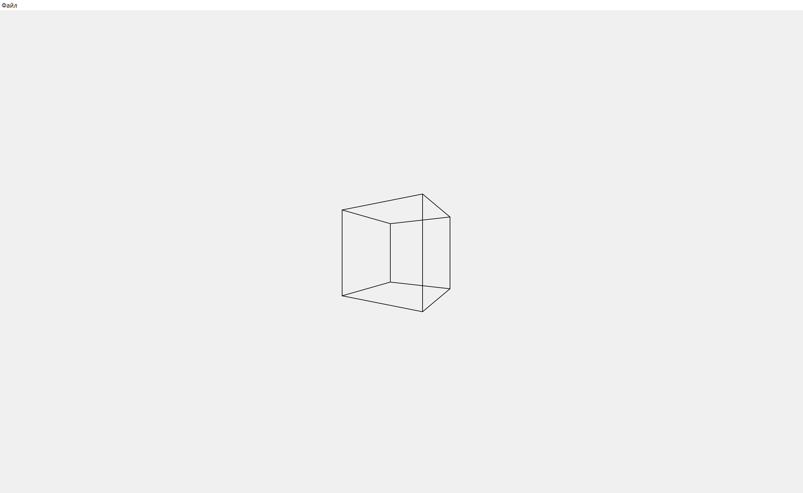

# Лабораторная работа №4 - Геометрические преобразования

## Задача

---

Разработать графическую программу, выполняющую следующие геометрические преобразования 
над трехмерным объектом: перемещение, поворот, скалирование, отображение, перспектива.
В программе должно быть предусмотрено считывание координат 3D объекта из текстового файла,
обработка клавиш и выполнение геометрических преобразований в зависимости от нажатых клавиш.
Все преобразования следует производить с использованием матричного аппарата и представления
координат в однородных координатах.

## Ход работы

---

### Средства разработки
1. Язык программирования Python.
2. Встроенная библиотека Numpy.
3. Встреонная библиотеке PyQt5.

### Используемые матрицы

**Единичная матрица**

| 1 | 0 | 0 | 0 |
|---|---|---|---|
| 0 | 1 | 0 | 0 |
| 0 | 0 | 1 | 0 |
| 0 | 0 | 0 | 1 |


**Матрица сдвига**

| 1 | 0 | 0 | dx |
|---|---|---|----|
| 0 | 1 | 0 | dy |
| 0 | 0 | 1 | dz |
| 0 | 0 | 0 | 1  |

**Матрица масштабирования**

| sx | 0  | 0  | 0 |
|----|----|----|---|
| 0  | sy | 0  | 0 |
| 0  | 0  | sz | 0 |
| 0  | 0  | 0  | 1 |


### Описание алгоритма
1. Перемещение объекта
   1. При нажатии клавиш перемещения (`W`, `A`, `S`, `D`, `Q`, `E`) создается матрица сдвига.
   2. Эта матрица умножается на общую матрицу преобразований объекта.
   3. Таким образом, каждая вершина объекта смещается на заданное расстояние по соответствующей оси.
2. Масштабирование
   1. При нажатии клавиш масштабирования (`+`, `-`) формируется матрица масштабирования.
   2. `sx`, `sy`, `sz` - коэффициенты масштабирования (например, 1.1 или 0.9).
   3. Матрица масштабирования умножается на общую матрицу преобразований объекта.
   4. Таким образом, объект однородно увеличивается или уменьшается.
3. Вращение
   1. При нажатии клавиш вращения (стрелки, `C`, `V`) создаются матрицы поворота вокруг соответствующих осей.
   2. Каждая матрица поворота умножается на общую матрицу преобразований, изменяя ориентацию объекта в пространстве
4. Отражение
   1. При нажатии клавиш отражения (`Z`, `X`, `Y`) сначала выполняется вычисление центра объекта с учетом накопленных преобразований
   2. Затем создается матрица отражения относительно выбранной плоскости.
   3. Затем создается композиция из матрицы переноса в центр, матрицы отражения и матрицы возврата обратно.
   4. Результат композиции применяется к общей матрице, в результате объект отражается относительно своего центра.
5. Сброс - при нажатии на клавишу `R` общая матрица преобразований заменяется на единичную, что возвращает объект в исходное положение и состояние.

### Реализация основных частей кода

**Матричные операции**
```python
def translation_matrix(dx, dy, dz) -> np.ndarray:
    return np.array([
        [1, 0, 0, dx],
        [0, 1, 0, dy],
        [0, 0, 1, dz],
        [0, 0, 0, 1]
    ], dtype=float)


def scale_matrix(sx, sy, sz) -> np.ndarray:
    return np.array([
        [sx, 0, 0, 0],
        [0, sy, 0, 0],
        [0, 0, sz, 0],
        [0, 0, 0, 1]
    ], dtype=float)


def rotation_matrix_x(theta) -> np.ndarray:
    c, s = np.cos(theta), np.sin(theta)
    return np.array([
        [1, 0, 0, 0],
        [0, c, -s, 0],
        [0, s, c, 0],
        [0, 0, 0, 1]
    ], dtype=float)


def rotation_matrix_y(theta) -> np.ndarray:
    c, s = np.cos(theta), np.sin(theta)
    return np.array([
        [c, 0, s, 0],
        [0, 1, 0, 0],
        [-s, 0, c, 0],
        [0, 0, 0, 1]
    ], dtype=float)


def rotation_matrix_z(theta) -> np.ndarray:
    c, s = np.cos(theta), np.sin(theta)
    return np.array([
        [c, -s, 0, 0],
        [s, c, 0, 0],
        [0, 0, 1, 0],
        [0, 0, 0, 1]
    ], dtype=float)


def reflection_matrix(axis) -> np.ndarray:
    if axis == 'xy':
        return scale_matrix(1, 1, -1)
    elif axis == 'yz':
        return scale_matrix(-1, 1, 1)
    elif axis == 'xz':
        return scale_matrix(1, -1, 1)
    else:
        raise ValueError('Неверная координатная плоскость')


def compose_matrices(*matrices) -> np.ndarray:
    result = np.identity(4)
    for m in reversed(matrices):
        result = result @ m
    return result


def reflect_about_center(center: tuple, reflection_matrix: np.ndarray) -> np.ndarray:
    cx, cy, cz = center
    to_origin: np.ndarray = translation_matrix(-cx, -cy, -cz)
    back: np.ndarray = translation_matrix(cx, cy, cz)
    return compose_matrices(back, reflection_matrix, to_origin)


def perspective_projection_matrix(d = 1.) -> np.ndarray:
    return np.array([
        [1, 0, 0, 0],
        [0, 1, 0, 0],
        [0, 0, 1, 0],
        [0, 0, 1 / d, 0]
    ], dtype=float)
```

**Назначение клавиш**
```python
        if key == Qt.Key_W:
            t = matrix_utils.translation_matrix(0, 0.1, 0)
        elif key == Qt.Key_S:
            t = matrix_utils.translation_matrix(0, -0.1, 0)
        elif key == Qt.Key_A:
            t = matrix_utils.translation_matrix(-0.1, 0, 0)
        elif key == Qt.Key_D:
            t = matrix_utils.translation_matrix(0.1, 0, 0)
        elif key == Qt.Key_Q:
            t = matrix_utils.translation_matrix(0, 0, 0.1)
        elif key == Qt.Key_E:
            t = matrix_utils.translation_matrix(0, 0, -0.1)

        elif key == Qt.Key_Left:
            t = matrix_utils.rotation_matrix_y(np.radians(-10))
        elif key == Qt.Key_Right:
            t = matrix_utils.rotation_matrix_y(np.radians(10))
        elif key == Qt.Key_Up:
            t = matrix_utils.rotation_matrix_x(np.radians(-10))
        elif key == Qt.Key_Down:
            t = matrix_utils.rotation_matrix_x(np.radians(10))
        elif key == Qt.Key_C:
            t = matrix_utils.rotation_matrix_z(np.radians(-10))
        elif key == Qt.Key_V:
            t = matrix_utils.rotation_matrix_z(np.radians(10))

        elif key == Qt.Key_Plus or key == Qt.Key_Equal:
            t = matrix_utils.scale_matrix(1.1, 1.1, 1.1)
        elif key == Qt.Key_Minus or key == Qt.Key_Underscore:
            t = matrix_utils.scale_matrix(0.9, 0.9, 0.9)

        elif key == Qt.Key_Z:
            center = self.object3d.get_center(self.transform.get_matrix())
            t = matrix_utils.reflect_about_center(center, matrix_utils.reflection_matrix('xy'))
        elif key == Qt.Key_X:
            center = self.object3d.get_center(self.transform.get_matrix())
            t = matrix_utils.reflect_about_center(center, matrix_utils.reflection_matrix('yz'))
        elif key == Qt.Key_Y:
            center = self.object3d.get_center(self.transform.get_matrix())
            t = matrix_utils.reflect_about_center(center, matrix_utils.reflection_matrix('xz'))

        elif key == Qt.Key_R:
            self.transform.reset()
            self.update()
            return
```

### Результат работы программы 

**Главное окно программы**

