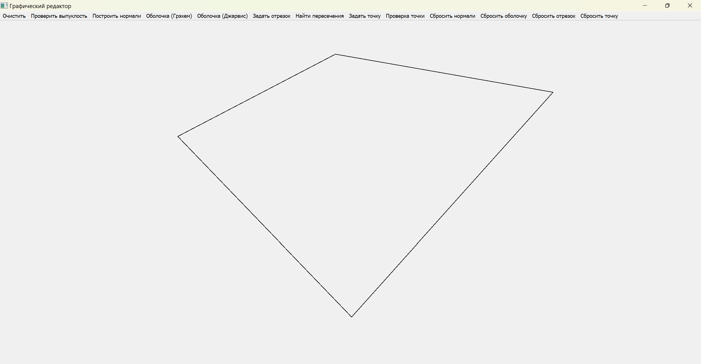
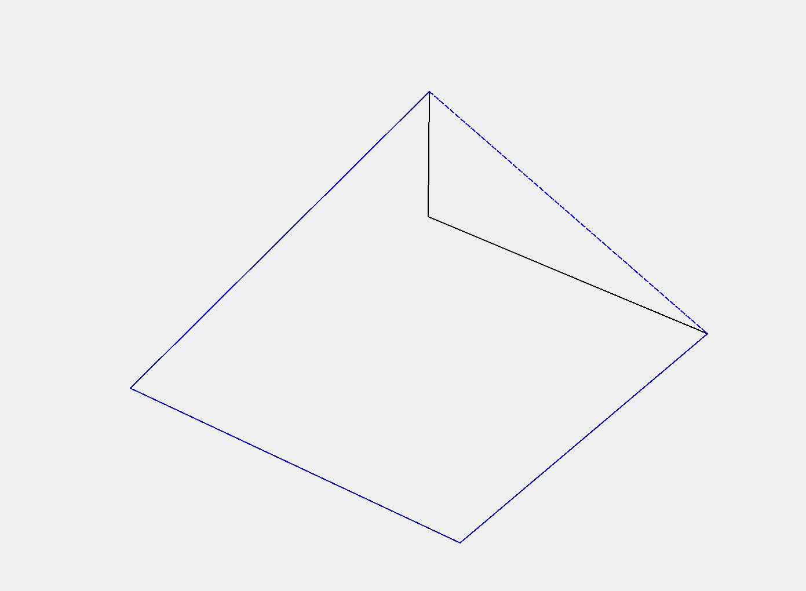
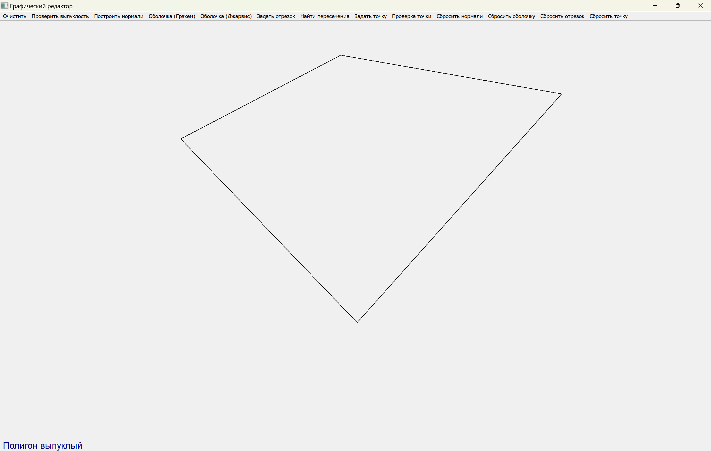
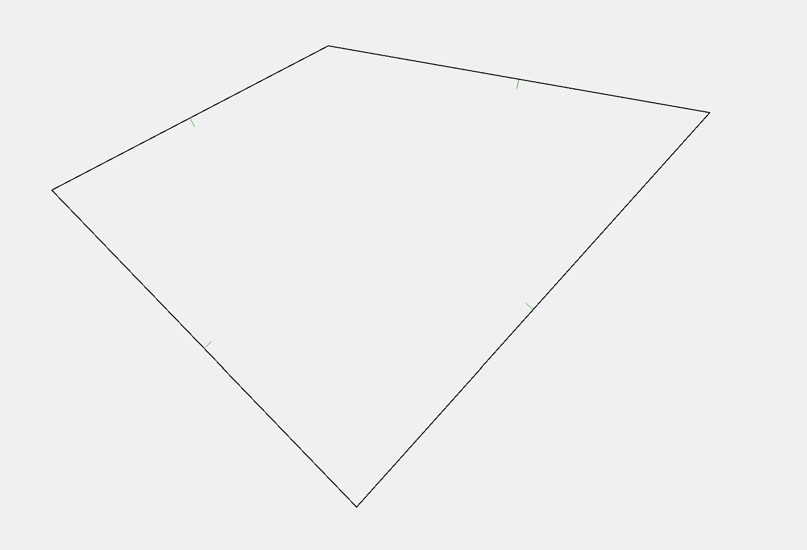
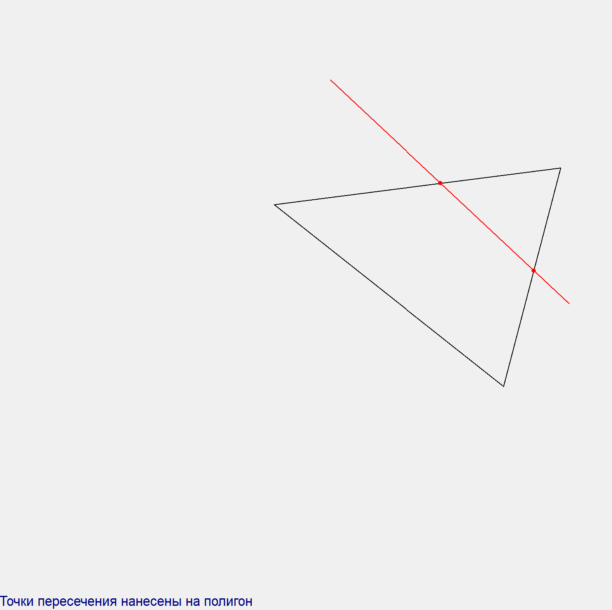
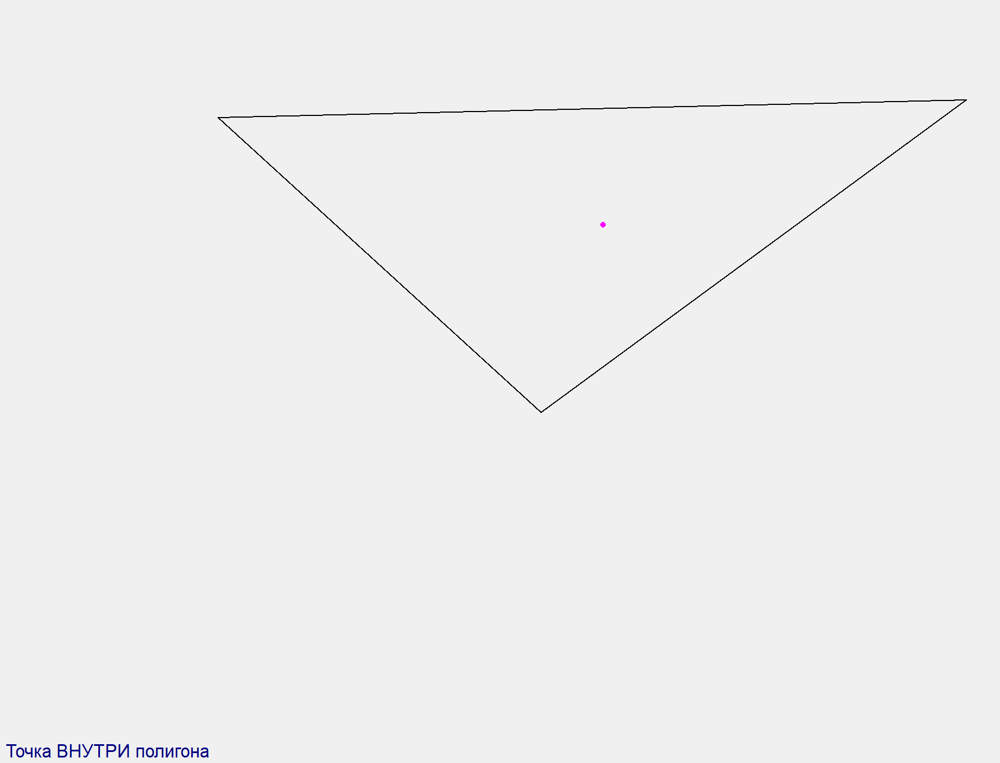

# Лабораторная работа №5 - Предварительная обработка полигонов

## Задача

---

Разработать элементарный графический редактор, реализующий построение полигонов. Реализованная программа должна уметь проверять полигон на выпуклость, находить его внутренние нормали. Программа должна выполнять построения выпуклых оболочек методом обхода Грэхема и методом Джарвиса. Выбор метода задается из пункта меню и должен быть доступен через панель инструментов "Построение полигонов". Графический редактор должен позволять рисовать линии первого порядка(методом цда или брезенхема) и определять точки пересечения отрезка со стороной полигона, также программа должна определять принадлежность введенной точки полигону.

## Ход работы

---

### Средства разработки
1. Язык программирования Python.
2. Встроенная библиотека math.
3. Встреонная библиотеке PyQt5.

### Описание алгоритма
1. Точки для полигона задаются на холсте левой кнопкой мыши. Когда на холсте достаточно точек для построения полигона, он строится и перестраивается при добавлении точек автоматически.
2. Алгоритм Грэхема для построения выпуклой оболочки
   1. Ищется точка с минимальной координатой y в качестве опорной.
   2. Остальные точки сортируются по полярному углу относительно опорной.
   3. Алгоритм проходит по отсортированным точкам, добавляя их в стек и проверяя поворот: если очередная тройка точек образует правый (невыпуклый) поворот, последняя точка из стека удаляется.
   4. В результате получается список точек, образующих выпуклую оболочку.
3. Алгоритм Джарвиса для построения выпуклой оболочки
   1. Алгоритм начинает с самой левой точки.
   2. На каждом шаге выбирается следующая точка, образующая наиболее левый поворот относительно текущей.
   3. Шаги повторяются, пока текущая точка не станет равна исходной.
   4. В результате получается список точек, образующих выпуклую оболочку.
4. Алгоритм проверки полигона на выпуклость
   1. Для каждой тройки подряд идущих вершин вычисляется знак векторного произведения (он определяет направление поворота).
   2. Если обнаруживаются повороты разных направлений (один - левый, другой - правый), многоугольник невыпуклый.
   3. Если все повороты одного знака (или коллинеарные), многоугольник считается выпуклым.
5. Алгоритм вычисления внутренних нормалей к сторонам полигона
   1. Для каждой стороны строится вектор направления.
   2. Нормаль вычисляется как поворот вектора на 90 градусов внутрь (ориентированное направление).
   3. Нормаль нормируется (единичная длина) и сохраняется как пара: середина ребра и вектор нормали.
6. Алгоритм нахождения точек пересечения отрезка с многоугольником
   1. Для каждой стороны многоугольника вычисляется точка пересечения с данным отрезком.
   2. Используется аналитическое решение для пересечения двух отрезков с проверкой попадания в пределы обоих отрезков.
   3. Все найденные точки пересечения собираются в список, который в итоге возвращается.
7. Алгоритм проверки принадлежности точки полигону
   1. Строится луч вправо от точки и проверяется количество пересечений с ребрами полигона.
   2. Если количество нечетное - точка находится внутри.

### Реализация основных частей кода

**Алгоритм Грэхема для построения выпуклой оболочки**
```python
def graham_scan(points: List[QPointF]) -> List[QPointF]:

    def polar_angle(p0: QPointF, p1: QPointF) -> float:
        dx: float = p1.x() - p0.x()
        dy: float = p1.y() - p0.y()
        return math.atan2(dy, dx)

    def distance(p0: QPointF, p1: QPointF) -> float:
        return (p1.x() - p0.x()) ** 2 + (p1.y() - p0.y()) ** 2

    def cross(o: QPointF, a: QPointF, b: QPointF) -> float:
        return (a.x() - o.x()) * (b.y() - o.y()) - (a.y() - o.y()) * (b.x() - o.x())

    if len(points) < 3:
        return points.copy()

    start: QPointF = min(points, key=lambda p: (p.y(), p.x()))
    sorted_points: List[QPointF] = sorted(
        points,
        key=lambda p: (polar_angle(start, p), -distance(start, p))
    )

    hull: List[QPointF] = []
    for p in sorted_points:
        while len(hull) >= 2 and cross(hull[-2], hull[-1], p) <= 0:
            hull.pop()
        hull.append(p)

    return hull
```

**Алгоритм Джарвиса для построения выпуклой оболочки**
```python
def jarvis_march(points: List[QPointF]) -> List[QPointF]:
    def orientation(p: QPointF, q: QPointF, r: QPointF) -> int:
        val: float = (q.y() - p.y()) * (r.x() - q.x()) - (q.x() - p.x()) * (r.y() - q.y())
        if val == 0.:
            return 0  # коллинеарны
        return 1 if val > 0 else 2  # 1 - по часовой, 2 - против

    if len(points) < 3:
        return points.copy()

    hull: List[QPointF] = []
    leftmost: int = min(
        range(len(points)),
        key=lambda i: (points[i].x(), points[i].y())
    )
    p: int = leftmost

    while True:
        hull.append(points[p])
        q: int = (p + 1) % len(points)

        for i in range(len(points)):
            if orientation(points[p], points[i], points[q]) == 2:
                q = i

        p = q
        if p == leftmost:
            break

    return hull
```

**Алгоритм проверки полигона на выпуклость**
```python
def is_convex(polygon: List[QPointF], epsilon: float = 1e-6) -> bool:
    def cross(o: QPointF, a: QPointF, b: QPointF) -> float:
        return (a.x() - o.x()) * (b.y() - o.y()) - (a.y() - o.y()) * (b.x() - o.x())

    n: int = len(polygon)
    if n < 3:
        return False

    sign: int = 0
    for i in range(n):
        o: QPointF = polygon[i]
        a: QPointF = polygon[(i + 1) % n]
        b: QPointF = polygon[(i + 2) % n]
        c: float = cross(o, a, b)

        if abs(c) < epsilon:
            continue

        current_sign: int = 1 if c > 0 else -1
        if sign == 0:
            sign = current_sign
        elif sign != current_sign:
            return False

    return sign != 0
```

**Алгоритм вычисления внутренних нормалей к сторонам полигона**
```python
def compute_internal_normals(polygon: List[QPointF]) -> List[Tuple[Tuple[int, int], Tuple[float, float]]]:
    normals: List[Tuple[Tuple[int, int], Tuple[float, float]]] = []
    n: int = len(polygon)

    for i in range(n):
        p1: QPointF = polygon[i]
        p2: QPointF = polygon[(i + 1) % n]

        dx: float = p2.x() - p1.x()
        dy: float = p2.y() - p1.y()

        nx: float = dy
        ny: float = -dx

        length: float = math.hypot(nx, ny)
        if length == 0:
            continue
        nx /= length
        ny /= length

        mx: float = (p1.x() + p2.x()) / 2
        my: float = (p1.y() + p2.y()) / 2
        midpoint: Tuple[int, int] = int(mx), int(my)
        normal_vector: Tuple[float, float] = nx, ny

        normals.append((midpoint, normal_vector))

    return normals
```

**Алгоритм нахождения точек пересечения отрезка с многоугольником**
```python
def find_segment_polygon_intersection(segment_start: QPointF, segment_end: QPointF, polygon: List[QPointF]) -> List[QPointF]:
    def segment_intersection(p1: QPointF, p2: QPointF, q1: QPointF, q2: QPointF) -> Optional[QPointF]:
        def det(a, b):
            return a.x() * b.y() - a.y() * b.x()

        r = QPointF(p2.x() - p1.x(), p2.y() - p1.y())
        s = QPointF(q2.x() - q1.x(), q2.y() - q1.y())

        denom = det(r, s)
        if denom == 0:
            return None  # параллельны или совпадают

        qp = QPointF(q1.x() - p1.x(), q1.y() - p1.y())
        t = det(qp, s) / denom
        u = det(qp, r) / denom

        if 0 <= t <= 1 and 0 <= u <= 1:
            intersection = QPointF(p1.x() + t * r.x(), p1.y() + t * r.y())
            return intersection
        return None

    intersections = []
    n = len(polygon)
    for i in range(n):
        poly_start = polygon[i]
        poly_end = polygon[(i + 1) % n]
        point = segment_intersection(segment_start, segment_end, poly_start, poly_end)
        if point is not None:
            intersections.append(point)
    return intersections
```

**Алгоритм проверки принадлежности точки полигону**
```python
def is_point_inside_polygon(point: QPointF, polygon: List[QPointF]) -> bool:
    x: float = point.x()
    y: float = point.y()
    inside: bool = False
    n: int = len(polygon)

    for i in range(n):
        p1: QPointF = polygon[i]
        p2: QPointF = polygon[(i + 1) % n]

        if (p1.y() > y) != (p2.y() > y):
            x_intersect: float = (p2.x() - p1.x()) * (y - p1.y()) / (p2.y() - p1.y() + 1e-12) + p1.x()
            if x < x_intersect:
                inside = not inside

    return inside
```

### Результат работы программы

**Главное окно программы**


**Построение полигона**


**Построение выпуклой оболочки**


**Проверка полигона на выпуклость**


**Построение нормалей к сторонам полигона**


**Нахождение точек пересечения отрезка с полигоном**


**Проверка принадлежности точки полигону**

