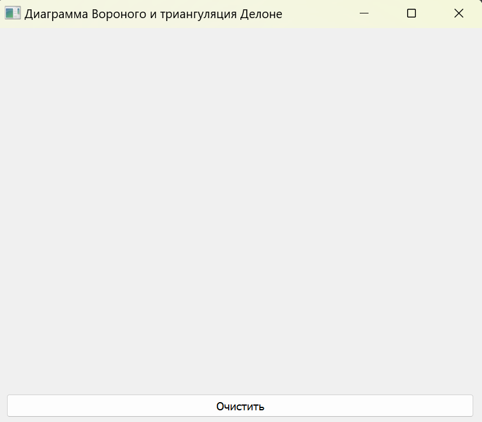
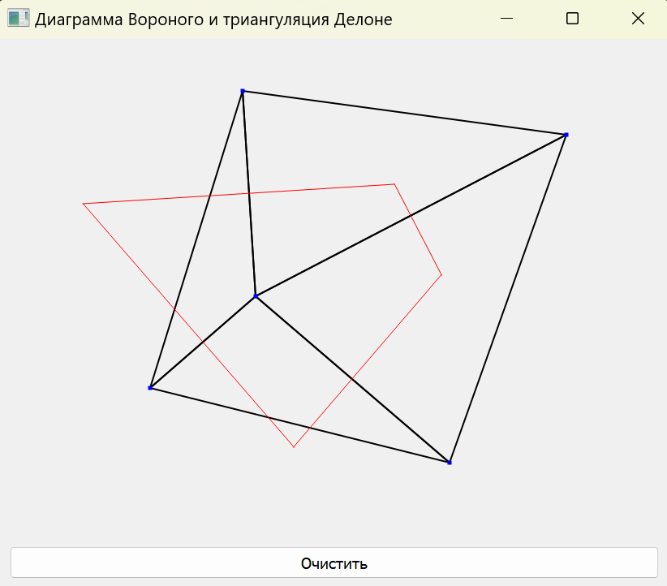

# Лабораторная работа №3 - Триангуляция. Построение диаграммы Вороного

## Задача

---

Разработать графическую программу, выполняющую триангуляцию Делоне и построение диаграммы Вороного по заданному набору точек.

### Ход работыы

---

### Средства разработки
1. Язык программирования Python.
2. Встроенная библиотека NumPy.
3. Встроенная библиотека SciPy.
4. Встроенная библиотека PyQt5.

### Описание алгоритма
1. Пользователь задает точки на холсте левой кнопкой мыши. При достаточном количестве точек отображается триангуляция Делоне и диаграмма Вороного.
2. Алгоритм триангуляции Делоне (был использован встроенный функционал библиотеки SciPy)
   1. Массив координат всех точек сохраняется в виде массива.
   2. Алгоритм определяет выпуклую оболочку точек.
   3. Далее точки добавляются по одной.
   4. Перестраиваются локальные треугольники, если нарушено условие Делоне (удаляются треугольники, в чьи вписанные окружности попала новая точка).
   5. Образовавшееся пространство с пробелами заполняется новыми треугольниками.
   6. Полученные треугольники возвращаются в виде списка троек индексов, соответствующих вершинам.
   7. По индексам строятся ребра треугольников.
3. Алгоритм построения диаграммы Вороного (был использован встроенный функционал библиотеки SciPy)
   1. Массив координат всех точек сохраняется в виде массива.
   2. Алгоритм находит все биссектрисы между парами точек.
   3. На основе пересечений полученных биссектрис определяются вершины диаграммы, ребра и списки верши, окружающих каждую точку.
   4. Строится двойственный граф к триангуляции Делоне: каждая вершина Вороного - центр окружности, описывающей треугольник в Делоне.
   5. Ребра соединяются между такими центрами, если соответствующие треугольники Делоне имеют общую сторону.
   6. Полученные ребра отображаются на экране.

### Реализация основных частей кода

**Отрисовка триангуляции Делоне**
```python
        if self.tri is not None:
            painter.setPen(QPen(Qt.black, 2))
            for simplex in self.tri.simplices:
                for i in range(3):
                    try:
                        p1_coords: np.ndarray = self.tri.points[simplex[i]]
                        p2_coords: np.ndarray = self.tri.points[simplex[(i + 1) % 3]]

                        if not (np.all(np.isfinite(p1_coords)) and np.all(np.isfinite(p2_coords))):
                            continue

                        p1_x, p1_y = int(p1_coords[0]), int(p1_coords[1])
                        p2_x, p2_y = int(p2_coords[0]), int(p2_coords[1])

                        if all(-10000 < c < 10000 for c in [p1_x, p1_y, p2_x, p2_y]):
                            painter.drawLine(QPoint(p1_x, p1_y), QPoint(p2_x, p2_y))

                    except (IndexError, ValueError, OverflowError):
                        continue
```

**Отрисовка диаграммы Вороного**
```python
        if self.voronoi is not None:
            painter.setPen(QPen(Qt.red, 1))
            for ridge_points, ridge_vertices in zip(self.voronoi.ridge_points, self.voronoi.ridge_vertices):
                if -1 not in ridge_vertices:
                    v0: np.ndarray = self.voronoi.vertices[ridge_vertices[0]]
                    v1: np.ndarray = self.voronoi.vertices[ridge_vertices[1]]
                    if np.all(np.isfinite(v0)) and np.all(np.isfinite(v1)):
                        painter.drawLine(QPoint(int(v0[0]), int(v0[1])), QPoint(int(v1[0]), int(v1[1])))
```

### Результат работы программы

**Главное окно программы**


**Отображение триангуляции Делоне и диаграммы Вороного**

